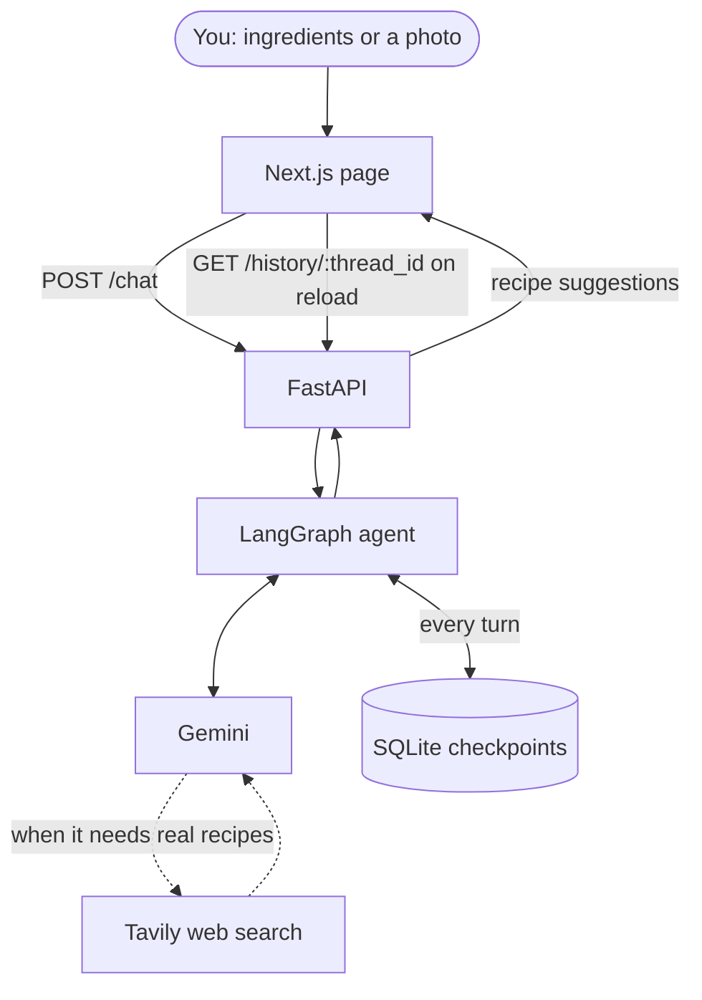

# 🥘 Personal Chef

A cooking agent for the food you already have. Tell it what is left in the fridge, or show it a photo, and it comes back with recipes built from those ingredients.

## 🎯 The Problem

Cooking rarely starts with a recipe. It starts with half an onion, three eggs and a bunch of parsley going soft. Searching for "recipes with eggs and parsley" returns blog posts that want eleven ingredients, nine of which you do not have, wrapped in two thousand words about someone's holiday in Provence.

## 💡 The Solution

Describe the leftovers in plain language, or take a photo of the shelf. The agent reads what is actually there, decides for itself when it needs to search the web, and suggests what you can cook tonight. Ask for the method and it walks you through it. The conversation is remembered, so you can come back later and pick up where you left off.

## 🧠 How It Works



**Step by step:**

1. **You send a message.** The page posts your text, any photo, and a thread id to `POST /chat`. The thread id is kept in `localStorage`, so it survives a reload.
2. **The photo travels as an image, not a description.** The backend encodes it as a base64 image block in the same message as your text, so the model looks at your shelf itself.
3. **The agent decides whether to search.** Nothing forces a web search — Gemini calls the Tavily tool only when the question needs real recipes, and answers directly when it does not.
4. **Search results come back to the model,** which reads them and writes the suggestion.
5. **The reply reaches the page** and appears in the conversation.
6. **Every turn is written to SQLite,** keyed by thread id. Restarting the backend does not lose the conversation.
7. **On reload the page calls `GET /history/{thread_id}`** and replays what was said. Tool calls and their results are filtered out: they are the agent's working state, not part of the conversation.

## 🚀 Quick Start

Two processes, two terminals. Both API keys are required — the agent cannot answer without Gemini, and cannot find recipes without Tavily.

```bash
# Backend - FastAPI on port 8000
cd backend
cp .env.example .env    # add GOOGLE_API_KEY and TAVILY_API_KEY
uv sync
uv run uvicorn api:app --reload --port 8000
```

```bash
# Frontend - Next.js on port 3000
cd frontend
npm install
npm run dev
```

Then open http://localhost:3000.

| Key | Where to get it |
|---|---|
| `GOOGLE_API_KEY` | [Google AI Studio](https://aistudio.google.com/apikey) |
| `TAVILY_API_KEY` | [Tavily](https://app.tavily.com) |

Both live in `backend/.env`, which is gitignored. So is `backend/checkpoints.sqlite`, which holds the conversations.

## 🌍 Deployment

The two halves deploy separately: a static Next.js frontend, and a Python service that needs to keep a file on disk.

| | |
|---|---|
| **Frontend** | Any static host. Set the backend's public address as an environment variable instead of the hardcoded `http://localhost:8000`. |
| **Backend** | Any host that runs Python and offers persistent storage. `checkpoints.sqlite` must survive restarts, or every redeploy wipes the conversations. |

Two things must change before it works in public:

- **CORS.** `backend/api.py` allows `http://localhost:3000` only. The deployed frontend's address has to be added, or every request from it is blocked.
- **Secrets.** `GOOGLE_API_KEY` and `TAVILY_API_KEY` move from `.env` into the host's environment variables. The `.env` file itself is never deployed.

## 📁 Project Structure

| Path | Contents |
|---|---|
| `backend/agent.py` | the LangGraph agent, its tools and the SQLite checkpointer |
| `backend/api.py` | FastAPI: `POST /chat` and `GET /history/{thread_id}` |
| `frontend/app/page.tsx` | the whole interface |
| `frontend/app/globals.css` | design tokens and the scaling units |
| `frontend/public/food/` | the illustrations |

## 🧩 Built With

**Google Gemini** · **LangChain** · **LangGraph** · **FastAPI** · **Tavily** · **SQLite** · **Next.js** · **TypeScript** · **Tailwind CSS**

## 📄 License

Copyright © 2026 Olga Aksenova.

The code in this repository is licensed under the **[Apache License, Version 2.0](https://www.apache.org/licenses/LICENSE-2.0)** – see [LICENSE](LICENSE) for the full text.
