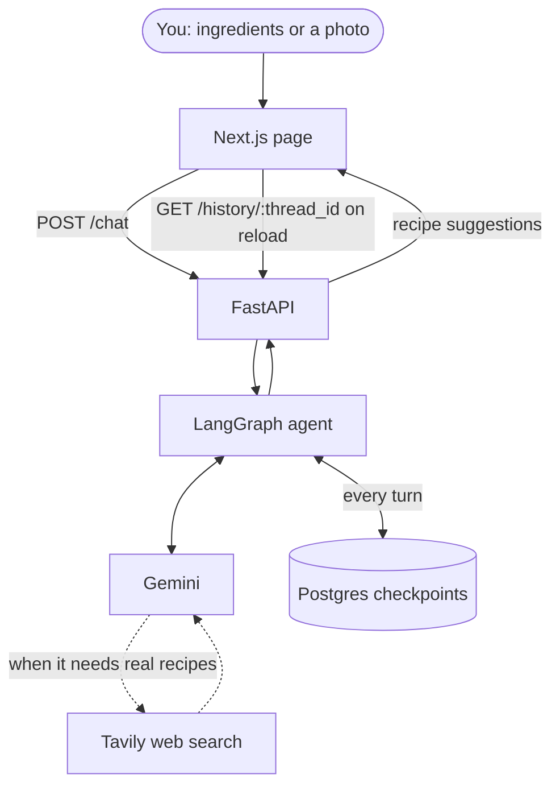

# 🥘 Personal Chef

Personal Chef is a cooking AI agent that tells you what to cook based on the food you already have. Describe your leftovers or photograph them, and it finds recipes that fit. Built with Google Gemini, LangGraph, FastAPI and Next.js.

### 🔗 **[Try it live](https://my-personal-chef.vercel.app)**

## 🎯 The Problem

Cooking rarely starts with a recipe. It starts with half an onion, three eggs and a bunch of parsley going soft. Searching for "recipes with eggs and parsley" returns blog posts that want eleven ingredients, nine of which you do not have, wrapped in two thousand words about someone's holiday in Provence.

## 💡 The Solution

Tell it what is left, in plain language or as a photo of the shelf. It works out what you actually have, searches the web when the question needs it, and suggests what you can cook tonight. Ask for the method and it walks you through it.

- **Text or a photo** — list the ingredients, or photograph them and let the model read the shelf itself
- **Real recipes** — it searches the web rather than inventing plausible ones
- **Remembers** — history lives in Postgres, so a reload or a redeploy does not lose the thread
- **Starts over** — one button abandons the conversation and begins a clean one

## 🧠 How It Works

```mermaid
flowchart TD
    You(["You: ingredients or a photo"]) --> Page["Next.js page"]
    Page -->|"POST /chat"| API["FastAPI"]
    API --> Agent["LangGraph agent"]
    Agent <--> Gemini["Gemini"]
    Gemini -.->|"when it needs real recipes"| Tavily["Tavily web search"]
    Tavily -.-> Gemini
    Agent <-->|"every turn"| DB[("Postgres checkpoints")]
    Agent --> API
    API -->|"recipe suggestions"| Page
    Page -->|"GET /history/:thread_id on reload"| API
```

**An agent, not a chatbot.** Nothing in the code decides to search. Gemini is handed a tool and chooses each turn whether to reach for it, so "hello" is answered directly and "what can I make with eggs and spinach" sends it looking.

**A photo stays a photo.** It travels as an image block beside the text in the same message, so the model looks at the shelf rather than at someone's description of it.

**The conversation outlives the server.** Every turn is written to Postgres under a thread id the browser keeps, and replaying a thread filters the tool calls back out — those are the agent's working state, not something you said.

## 🧩 Built With

**Google Gemini** · **LangChain** · **LangGraph** · **Tavily** · **FastAPI** · **Postgres** · **Next.js** · **TypeScript** · **Tailwind CSS**

Frontend on Vercel, backend on Render, database on Supabase.

## ⚠️ Honest Limits

- **The free Gemini tier is a daily budget.** A heavy day of use exhausts it, and the app answers with an error until it resets.
- **The backend sleeps.** On a free instance the first request after a quiet spell waits about a minute while it wakes.
- **The illustrations set the layout.** The page is drawn against a fixed reference design, so it adapts by scaling rather than by rearranging.

## 📄 License

Copyright © 2026 Olga Aksenova.

The code in this repository is licensed under the **[Apache License, Version 2.0](https://www.apache.org/licenses/LICENSE-2.0)** – see [LICENSE](LICENSE) for the full text.
