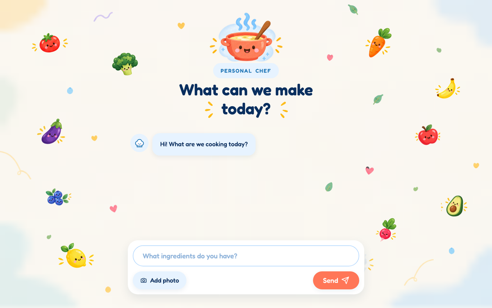
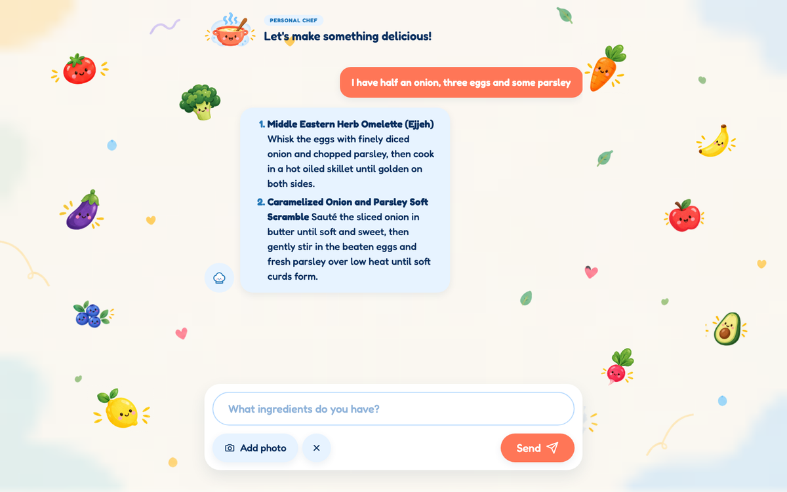

# 🥘 Personal Chef

An AI cooking agent that turns the ingredients you have into meals you can actually make. Without the extra shopping, guesswork, or endless recipe hunting.

### 🔗 **[Try it live](https://my-personal-chef.vercel.app)**

## 🎯 The Problem

Cooking rarely starts with a recipe. You have leftovers, a few vegetables, and no clear idea what to make. Traditional recipe search often gives you dishes that require ingredients you don’t have, turning a simple dinner into another trip to the store.

## 💡 The Solution

Personal Chef works backwards. You describe what you have or upload a photo of your ingredients, and the agent finds recipes that fit, adapts to what’s available, and guides you through cooking step by step.

## 💬 How a conversation goes

1. You say what is left. Type it or photograph the shelf and let the agent read the ingredients itself. 
2. The agent goes looking. It calls a web search on its own, and comes back with a few things you could make, each with the method in a line.
3. You pick one and keep talking. Ask for the full steps on one of them. Mention some ingredients you forgot about. Say what you do not eat. The suggestions move with you.
4. The agent holds the thread. Close the tab mid-recipe. Come back tomorrow and everything you said is still there.
5. If you want to start over, one button abandons the conversation and begins a clean one.

## 🧠 How It Works

```mermaid
flowchart TD
    You(["You: ingredients or a photo"]) --> Page["Next.js page"]
    Page -->|"POST /chat"| API["FastAPI"]
    API --> Agent["LangGraph agent"]
    Agent <--> Gemini["Gemini"]
    Gemini -.->|"when it needs real recipes"| Tavily["Tavily web search"]
    Tavily -.-> Gemini
    Agent <-->|"every turn"| DB[("Postgres checkpoints")]
    Agent --> API
    API -->|"recipe suggestions"| Page
    Page -->|"GET /history/:thread_id on reload"| API
```

## 🧩 Built With

| Stack | Used for |
|---|---|
| **Google Gemini** | Reads the ingredients, decides when a question needs the web, and comes back with the recipes |
| **LangChain** | Wraps the model and defines the search tool it can reach for |
| **LangGraph** | Runs the agent loop and checkpoints the conversation after every turn |
| **Tavily** | Finds real recipes on the web |
| **FastAPI** | Takes the requests: send a message, replay a thread |
| **Postgres** | Where the conversations live |
| **Next.js** | The interface |
| **Tailwind CSS** | Its styling |
| **Vercel** | Hosts the page |
| **Render** | Hosts the backend |
| **Supabase** | Hosts the database |

## 📄 License

Copyright © 2026 Olga Aksenova.

The code in this repository is licensed under the **[Apache License, Version 2.0](https://www.apache.org/licenses/LICENSE-2.0)** – see [LICENSE](LICENSE) for the full text.
